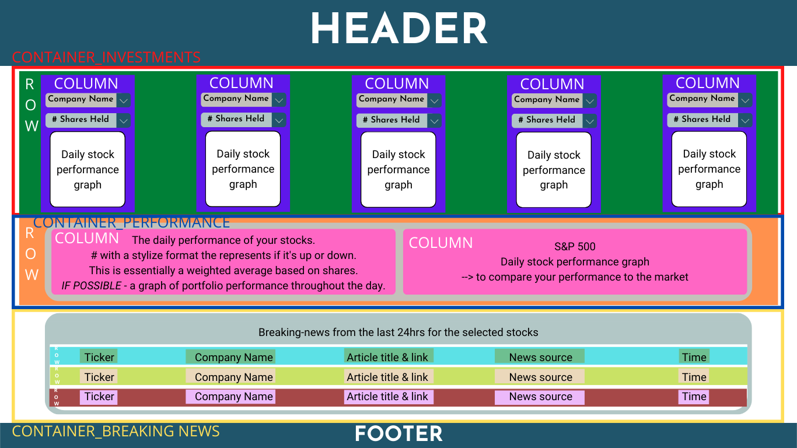
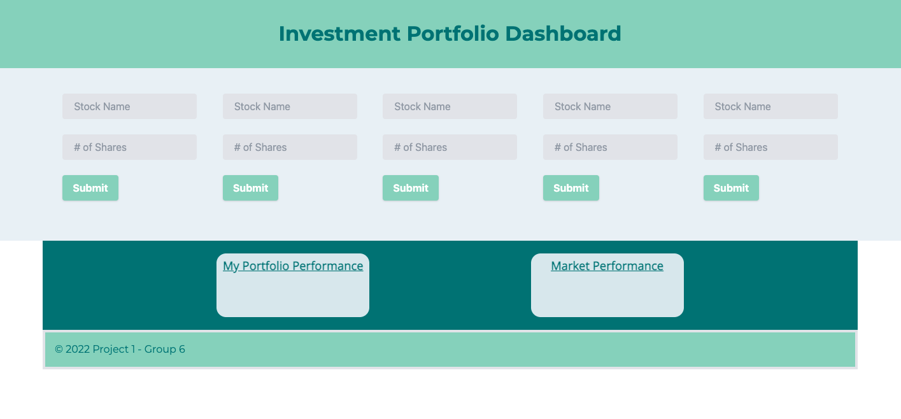
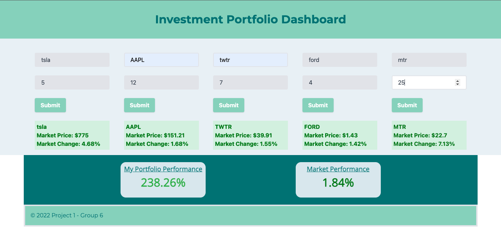

# Investment Portfolio Dashboard
An investment portfolio dashboard that will run in the browser and feature dynamically updated HTML and CSS utilizing the Yahoo Finance API and Breaking News API to retrieve pricing data and related breaking news for user-selected stocks. Uses localStorage for quick access to previously selected stocks and amount of shares held.

## User Story
AS AN investor, I WANT to see how my portfolio is performing and see breaking news related to my investments SO THAT I can evaluate my portfolio's performance compared to the market and make stock decisions.

## Acceptance Criteria
GIVEN a portfolio dashboard for 5 selected stocks,

WHEN I select which companies I'm invested in and how many shares of each I hold,
THEN a visual of the stock's daily performance is displayed.

WHEN I enter the number of shares I hold of each stock,
THEN the daily average performance of the portfolio is calculated.

WHEN the daily average performance of my portfolio is calculated,
THEN the performance percentage is displayed on the screen adjacent to the market's overall daily performance to compare to as a benchmark.

WHEN my daily average performance is display on the screen,
THEN it is color-coded to easily indicate if performance is up (green) or down (red).

WHEN I enter stocks in the user input form field,
THEN breaking news from the last 24 hrs is displayed for each company so that I may evaluate any impact it has on my holdings.

WHEN I open or refresh the application,
THEN stocks and shares a reloaded from my last session.

## Mock-up
</img>

## Wire Frame
</img>

## APIs Utilized
1. Yahoo Finance
Purpose: real-time stock price for the day
https://rapidapi.com/apidojo/api/yh-finance/

2. Morning Star Finance
Purpose: get real-time breaking news for specific companies
https://rapidapi.com/apidojo/api/ms-finance/details

## Deployed Application

Live URL: https://cpm-128.github.io/investment-portfolio-dashboard/

Repo URL: https://github.com/cpm-128/investment-portfolio-dashboard

Slide Deck: https://docs.google.com/presentation/d/1k4afwfDozcnew_TYOQx_yNhiT5vHPlI3EmYqO7GMzzQ/edit?usp=sharing

Screenshots:

</img>

</img>

## Future Updates
- WHEN breaking news is loaded on the page,
THEN I am presented with the stock's ticker, company name, article title, news source, and time the news article was published.
- WHEN I click the breaking news article title,
THEN the original article from the news source opens in a new tab.
- WHEN I have the application open,
THEN information will auto update every 15 minutes.
- Graph my portfolio's performance throughout the day in real-time (a graphical representation, like the stock market).
- Integration with various custodial platforms so holding will automatically updating, eliminating the manual input aspect.